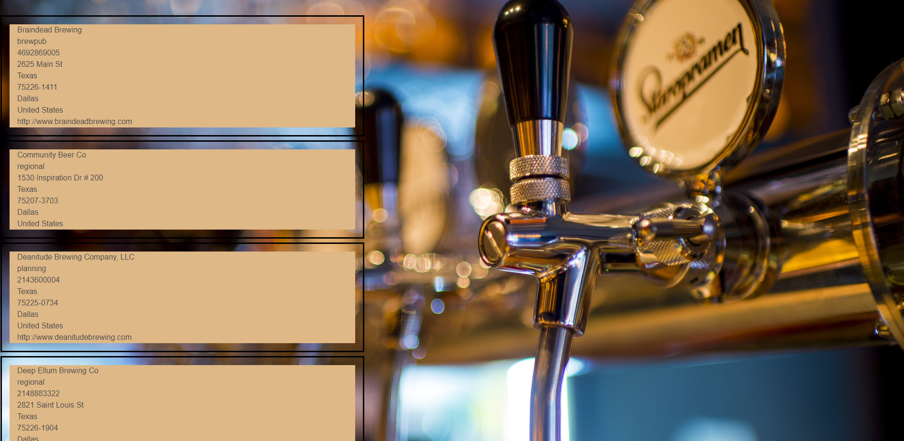
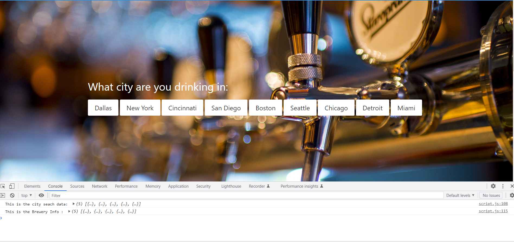
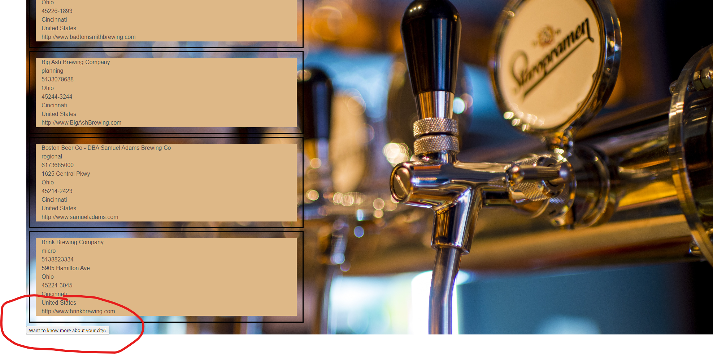

# what-to-do-and-where
Suggestions of what to do and where based on user location, companions, and budget

## Table of Contents

- [Installation](#installation)
- [Usage](#usage)
- [ChallengeURL](#challengeurl)
- [Credits](#credits)
- [License](#license)

## Usage 

 Breweries info progress
 Breweries progress code OK
 Modal button for now

# Where We Drankin'
Where We Drankin' is a web app using two API's to find bars based on your city and if you would like it can also give you information based on the city you choose. The information can include things such as average age, average rent cost of the area, etc.
​
## User Story
AS Somebody looking for a bar to go to and drink with friends
​
​
I WANT a list of bars in the city of my choice and to know the area well
​
​
SO THAT I can have fun and know the area
​
## Acceptance Criteria
GIVEN I open the page 
​
​
WHEN I click my cities' button
​
​
THEN I am given a list of bars and given the option to know more about the location
​
## Wireframe
​

​
## API Links
-Bluma Css: https://bulma.io/
​
​
-Teleport API: (https://developers.teleport.org/api/getting_started/)
​
​
-Open Brewery API: (https://www.openbrewerydb.org/documentation)
​
​
​
## Finished Product