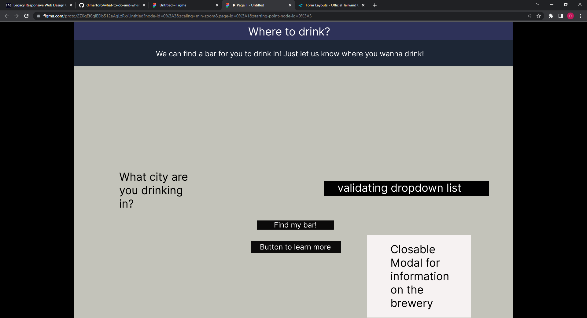
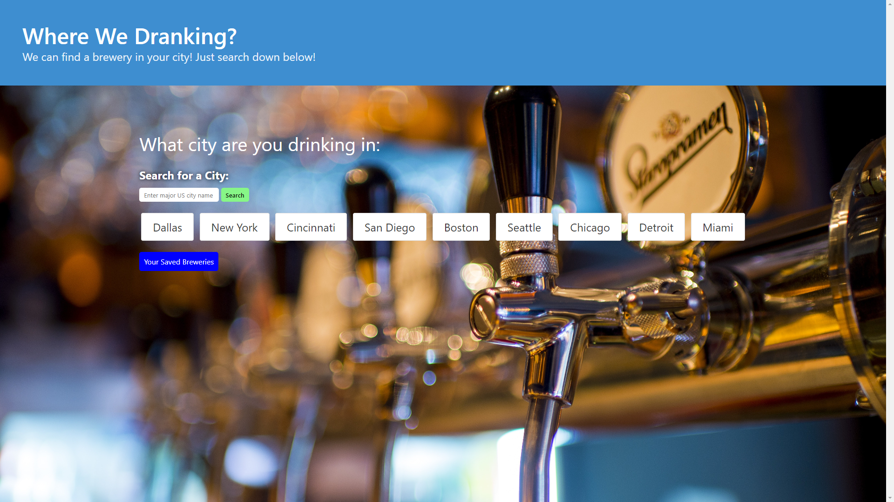
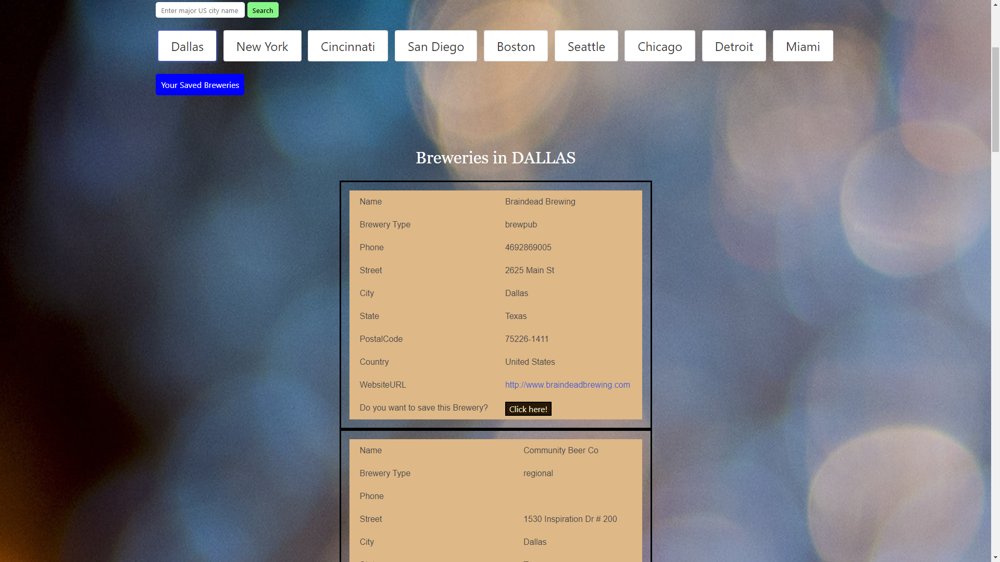
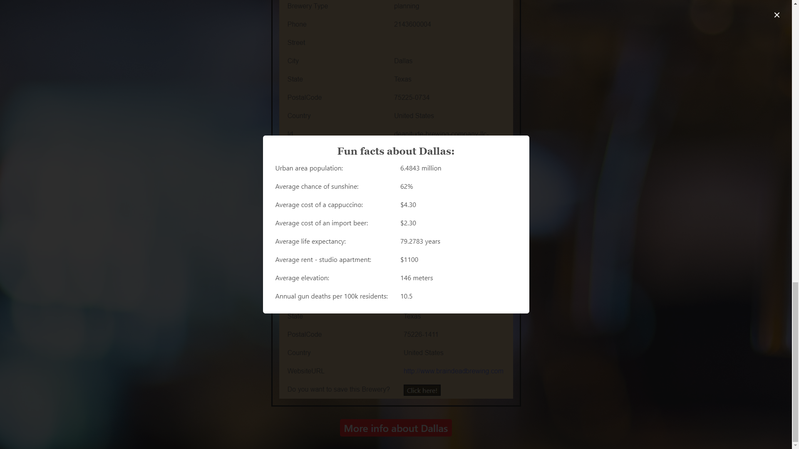
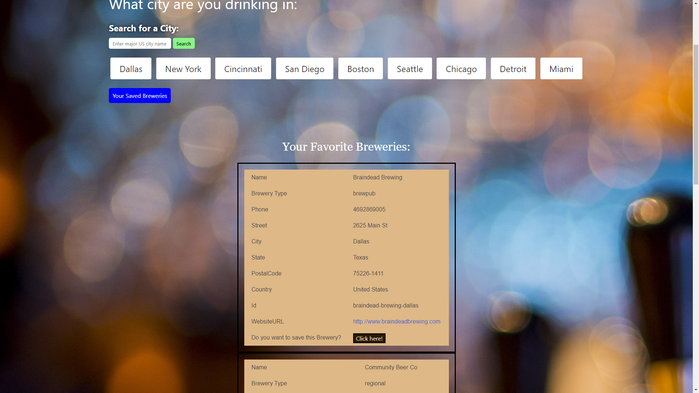
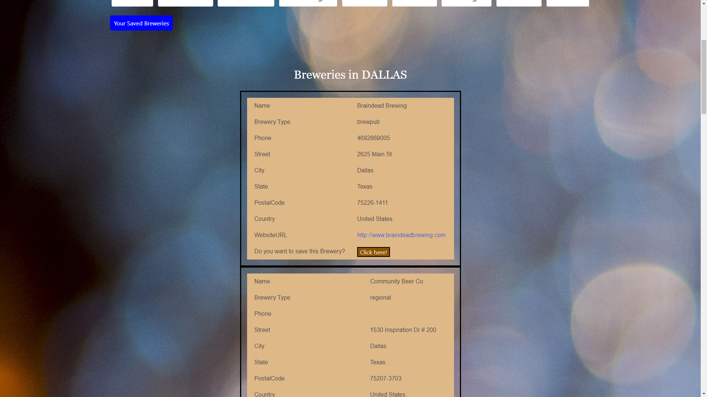

# Where We Drankin'
Where We Drankin' is a web app using two API's to find breweries based on your city and if you would like it can also give you fun facts about the city you choose. The information can include things such as average age, average rent cost of the area, etc. You have the option to save your favorite breweries to a list and access that list using local storage. You also have the option of searching for a city that is not on the preset button list and if it exists you will recieve a list of breweries for that as well.

## Table of Contents

- [User Story](#user-story)
- [Installation](#installation)
- [Usage](#usage)
- [URL](#url)
- [Credits](#credits)
- [License](#license)

​
## User Story
AS Somebody looking for a brewery to go to and drink with friends
​
​
I WANT a list of brewerys in the city of my choice and to know the area well
​
​
SO THAT I can have fun and know the area
​
## Acceptance Criteria
GIVEN I open the page 

​
​
WHEN I click my cities' button

​
​
THEN I am given a list of brewerys and given the option to know more about the location
​
## Installation
To use this website click the following URL link.

## Wireframe
​

​
## API Links
-Bluma Css: https://bulma.io/

​
​
-Teleport API: (https://developers.teleport.org/api/getting_started/)

​
​
-Open Brewery API: (https://www.openbrewerydb.org/documentation)
​
​
​
## Usage

Open Page:
 

Brewery List:
 

Modal:
 

Favorites List:
 

How to save to favorites:
  

